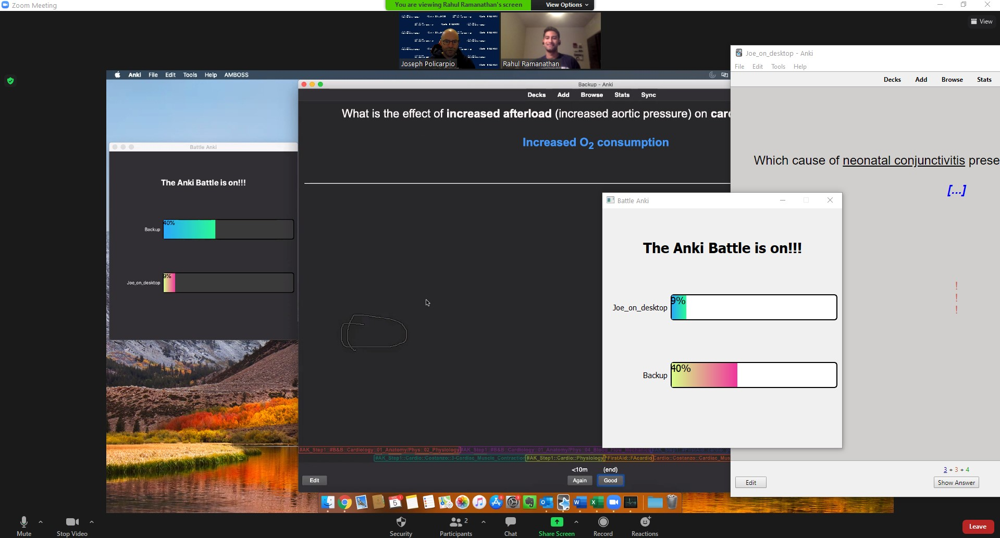

# What is Anki?

>[Anki](https://apps.ankiweb.net/){:target="_blank"} is amazing, open-source flash card software for learning and remembering anything you
>would like. The manual for the Anki program is available here: [https://docs.ankiweb.net/](https://docs.ankiweb.net/){:target="_blank"}.
>
>The Battle Anki add-on is not affiliated with, and was not created by the Anki development team.

 

# What is an Anki add-on?

>[Anki add-ons](https://docs.ankiweb.net/addons.html?highlight=add#add-ons){:target="_blank"} are third-party extensions to the Anki software
>that can be added to Anki to give it additional features and abilities. In addition to
>[Battle Anki](https://ankiweb.net/shared/info/613520216){:target="_blank"}, some examples that many medical students use are:
>>- [Image Occlusion Enhanced](https://ankiweb.net/shared/info/1111933094){:target="_blank"} - to hide parts of an image
>>- [Review Heatmap](https://ankiweb.net/shared/info/1771074083){:target="_blank"} - to visualize past and future card review activity
>>
>> Other works by this talented medical student by the pseudnym Glutanimate are available
>> [here](https://glutanimate.com/projects/#anki-addons){:target="_blank"}.

### A full list of available Anki add-ons is available on the Ankiweb here: [https://ankiweb.net/shared/addons/](https://ankiweb.net/shared/addons/){:target="_blank"}.

# Inspiration

 Battle Anki was created during the COVID-19 pandemic by a second-year medical student in preparation for an upcoming
 dedicated USMLE Step 1 study period. 

# Software Development
 
 In response to the quarantine, this software was developed to improve relatedness to colleagues while allowing for
 semi-independent study of unique topics.
 
 This add-on was developed in the Fall of 2020 by Joseph Policarpio, a then second-year medical student
 at the Carle Illinois College of Medicine. Having fundamental programming experience with Matlab and Visual Basic, he 
 learned the Python programming language in a period of roughly four weeks with the help of free, online resources 
 including instructional YouTube videos from [Tech With Tim](https://www.youtube.com/c/TechWithTim){:target="_blank"} and [Programming
 with Mosh](https://www.youtube.com/c/programmingwithmosh){:target="_blank"}. Many thanks to these outstanding teachers and developers.
 
 Of course, Mr. Policarpio was not alone in his endeavor - several friends and colleagues helped with troubleshooting, graphic user
 interface design,  ideas for functional features, and testing of alpha and beta releases.

## The First Battle 

After weeks of failure the first successful Battle Anki battle took place on November 5, 2020 with Rahul Ramanathan, a great friend and colleague.

Quite obsolete compared to the most recent Battle Anki version! 🤣
 
## Key Opinion Leaders
 
There is no greater compliment from a colleague than your willingness to risk your Anki collection. 
Your help and contributions will never be forgotten:    
Rahul Ramanathan    
Ashkhan Hojati    
Greg Payne    
Bara Saadah    
Katy Staufer    
Keith Cordner    
Natalie Ramsy    
Emily Smith    
Caywin Zhuang    
Anton Christensen    
Prachi Keni    
Lindsey Ades    

