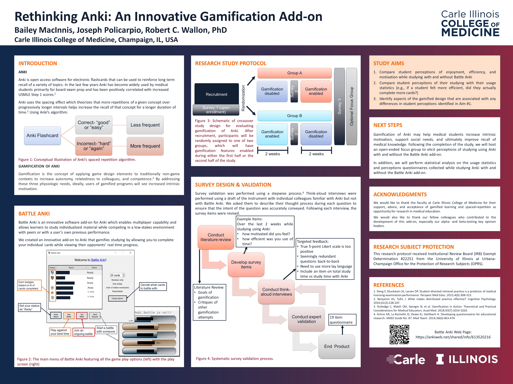

## Pilot Research Study

A pilot crossover study was conducted to assess perspectives on gamified learning in medical education, but due to several factors including technological issues, a statistical analysis was forgone as results were likely insignificant.

 

# Abstracts, Presentations, and Publications

 

### Coming soon - CIMED Retreat Presentation

  

>### 10/29/2021 - MELS Presentation
>{:target="_blank"}

 

> ### 6/17/2021 - IAMSE 25th Annual Meeting: Global Perspectives on Health Sciences Education
>
>{:target="_blank"}

  

> ### 4/16/2021 - Carle Illinois College of Medicine 19th Annual Health Innovation Research Day

<object data="./Images/Research/CIMED_HIRD.pdf" width="100%" height="800px">
    <embed src="./Images/Research/CIMED_HIRD.pdf">
        
This browser does not support PDFs. Please <a href="./Images/Research/CIMED_HIRD.pdf">download this PDF</a> to view it.

</object>

   

## Research Team

 

#### Joseph Policarpio

#### Bailey MacInnis

#### Dr. Robert Wallon